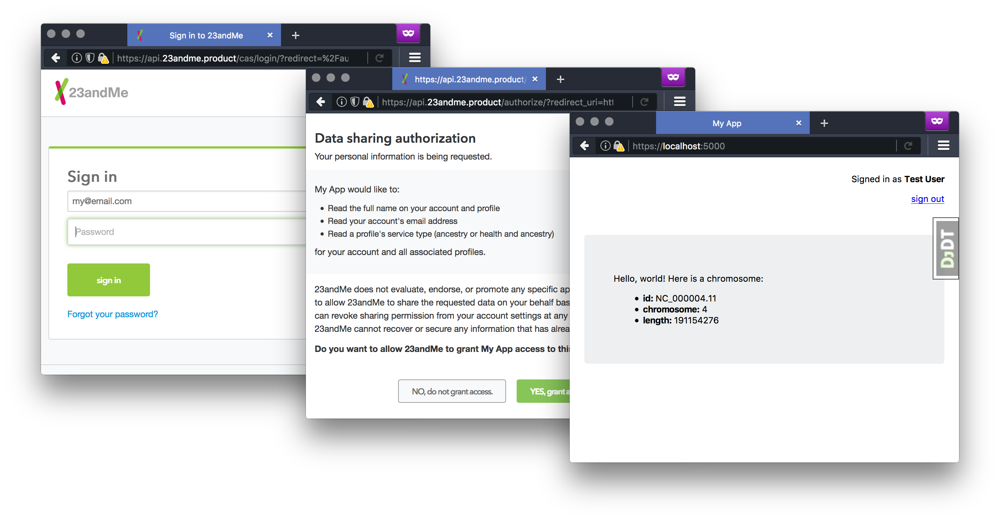

23andMe API Example Django Quickstart
===

This project is similar to our [api-example-django](https://github.com/23andMe/api-example-django) but includes pre-configured asset ([sass](http://sass-lang.com/) + [jquery](https://jquery.com/)) and heroku (with [postgres](https://www.postgresql.org/)) pipelines so you can get past the setup and start building your app right away. A pip package that's not yet released handles the OAuth2 authentication and API-interface, so, for now, it's hard-coded into `my_app/lib/ttam_api`, but stay tuned for an update when it's released!

You'll need to [sign up](https://api.23andme.com/cas/login/?redirect=%2Fapply%2F) to our API (if you haven't already) and be sure to check out our [documentation](https://api.23andme.com/docs/) to see what endpoints are available and how you can use them.

You'll also want to know how to use [django](https://docs.djangoproject.com/en/1.11/).

Requirements
---
* [node.js](https://nodejs.org/) >= 6 (with npm)
* [Python](https://www.python.org/downloads/release/python-360/) == 3.6.x (with pip)
* [python virtualenv](https://virtualenv.pypa.io/) >= 15.1.0
* [sqlite3](https://www.sqlite.org/) >= 3.16.0 (for local db)
* [chromedriver](https://sites.google.com/a/chromium.org/chromedriver/) >= 2.29 (also chrome - for selenium tests)

Development
---
**If you work at 23andMe, check out [this guide](https://23andme.atlassian.net/wiki/display/ENG/Develop+against+a+local+API) to learn how to develop against your local API.**
1. Clone the repo
1. `cd` into the repo
1. Run `./scripts/install_osx_dependencies.sh` if you have a mac and [homebrew](https://brew.sh/)
  * If you're using linux and `apt-get`, run `./scripts/install_apt_dependencies.sh`
1. Create your development variables `cp env.example .env`
1. Go to your [api dashboard](https://api.23andme.com/dev/) and change your `redirect_uri` to `https://localhost:5000/receive_code/`
1. Copy your `client_id` and `client_secret` from your [api dashboard](https://api.23andme.com/dev/) to your `.env`
1. Run `make venv`
1. Run `source venv/bin/activate`
1. Run `make`
1. Run `make start`
1. Go to https://localhost:5000
1. Start writing code!

When you're done:
1. `Ctrl-c` to quit the server
1. Run `dactivate` to exit the virtual environment

**Next time you come back, start at `source venv/bin/activate`.**

**After a `make clean`, open a new terminal window and start at `make venv`.**

Tests
---
* Run all tests with `make test`
* Run individual unit tests with `./manage.py test`

Sample Data
---
The fixture: `my_app/my_app/fixtures/intial_data.json` will be loaded into the dev db on every `make`.

Admin
---
The dev admin will be at https://localhost:5000/admin.
* username: `admin`
* password: `daisies`

Images
---
Put them in `my_app/assets/public/img`.

Production
---
To learn how to deploy to heroku, head over to the [production docs](docs/production.md).

